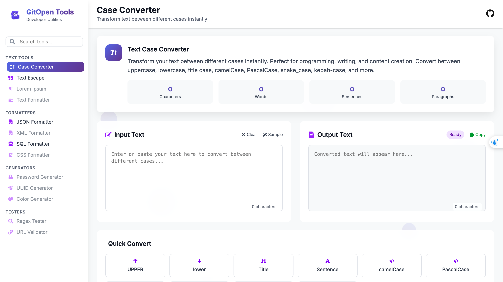
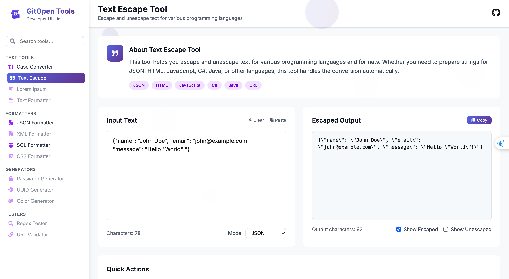
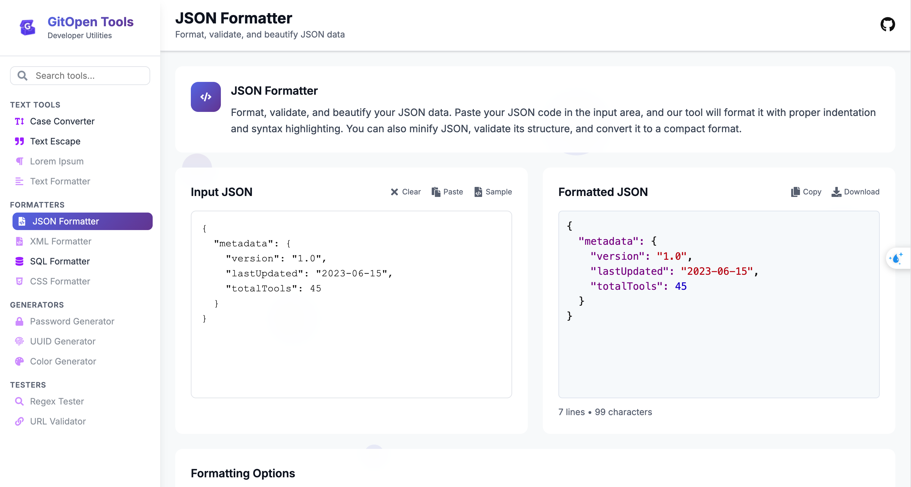
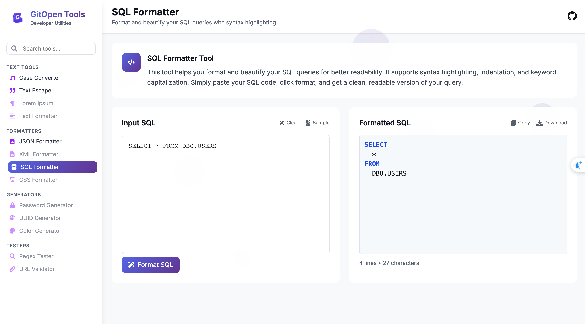

# GitOpen Tools

[]()
[]()

**GitOpen Tools** is a free, open-source toolkit designed to help developers streamline their workflow with commonly used utilities like JSON formatting, SQL beautification, JWT decoding, Regex testing, and more.

Visit our official website for an enhanced experience:  
**[www.gitopentools.com](https://www.gitopentools.com/)**

##  Screenshots / Demo

*(Include visual examples to showcase your tools in action. Replace placeholder images with your actual screenshots or GIFs.)*

- **Text Tools**  
  
  

- **Formatters**  
  
  

---

##  Getting Started

### Prerequisites

- NextJS (v15+)  
- npm or Yarn  


### Installation & Local Development

```bash
git clone https://github.com/steve-bang/gitopentools
cd GitOpenTools
npm install
npm run dev
```


## Contributing

We welcome all contributions! Here’s how to get started:
- Fork the repository
- Create a new branch:
```
git checkout -b feat/YourFeature
```

- Commit your changes with clear messaging, e.g.:
```
git commit -m "feat: add YAML converter"
```

- Push your branch and open a Pull Request
- We’ll review and hopefully merge your contribution soon.
- Please review our Code of Conduct and Contribution Guidelines if available.


## Contact & Support
- Official Website: [gitopentools.com](https://www.gitopentools.com/)
- Issues & Feature Requests: [GitHub Issues](https://github.com/steve-bang/gitopentools/issues)

---

## Why GitOpenTools?

- Open Source — community-driven, transparent, and customizable.
- Streamlined Workflow — a unified toolset for developers, all in one place.
- Flexible & Scalable — adapt and extend the toolkit as your project grows.

---

##  Suggestions to Consider

- **Visual polish**: Add a banner or logo at the top using an image asset if available.
- **Badges**: Display build status, download count, or coverage if applicable.
- **Contributing**: If you've set up issue templates or automated checks, reference them in the Contributing section.
- **Roadmap or TODO**: Consider an optional section listing planned features or enhancements.
- **Deployment**: If you publish to npm or host docs, add instructions under a “Deployment” or “Publish” section.